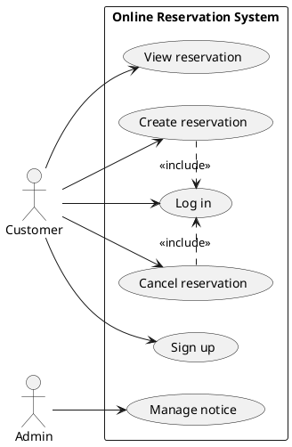
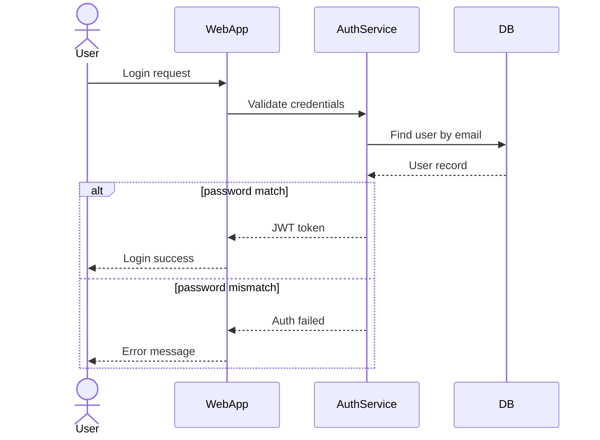
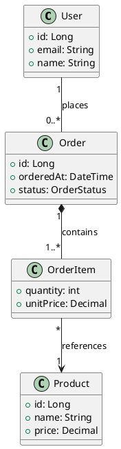

# 생성형 AI로 UML 작성하는 방법

생성형 AI로 UML을 만들 때는 그림을 바로 뽑게 하기보다, 요구사항을 먼저 정리하고 PlantUML이나 Mermaid 코드로 만든 다음 렌더링해서 검수하는 편이 훨씬 안정적이다.

---

## 1. Why?

생성형 AI를 쓰면 아래 작업이 빨라진다.

- 요구사항 문장에서 **액터(Actor)**, **엔티티(Entity)**, **서비스(Service)** 추출
- 유스케이스, 시퀀스, 클래스 다이어그램의 **초안 생성**
- PlantUML / Mermaid 같은 **텍스트 기반 다이어그램 코드 작성**
- 초안에 대한 **검수 포인트 정리**

다만 AI는 그럴듯하게 그려도 아래 같은 실수를 자주 한다.

- 관계 방향이 뒤집힘
- `include`와 `extend`를 헷갈림
- 클래스 다중성(`1`, `0..*`, `1..*`)이 빠짐
- 요구사항에 없는 요소를 추정으로 넣음

그래서 가장 안전한 방식은 **AI가 초안을 만들고, 사람이 구조를 검수하는 흐름**이다.

---

## 2. 추천 작업 흐름


### 작업 순서

1. **요구사항을 정리한다.**
   - 시스템 목적
   - 사용자 유형
   - 주요 기능
   - 핵심 엔티티
   - 반드시 지켜야 할 규칙

2. **AI에게 요소만 먼저 뽑게 한다.**
   - 액터 목록
   - 기능 목록
   - 클래스 목록
   - 메시지 흐름 목록

3. **UML 종류를 하나만 지정한다.**
   - 유스케이스
   - 시퀀스
   - 클래스
   - 컴포넌트
   - 상태
   - 액티비티

4. **출력 형식을 고정한다.**
   - 설명 없이 PlantUML 코드만 출력
   - Mermaid 코드만 출력
   - 관계가 불명확하면 보수적으로 표현

5. **생성 후 검수를 한 번 더 돌린다.**
   - 관계 방향
   - 다중성
   - 포함/확장 관계
   - 중복 요소
   - 빠진 예외 흐름

---

## 3. 프롬프트는 어떻게 써야 하나

결과 품질은 프롬프트에서 거의 결정된다. 아래 항목을 넣어주면 오류가 확 줄어든다.

### 넣어두면 좋은 항목

- 시스템 이름
- 문서 목적
- 다이어그램 종류
- 포함할 요소
- 관계 규칙
- 출력 형식
- 불필요한 추정 금지 조건

### 예시 템플릿

```text
너는 시스템 분석가다.
아래 정보를 바탕으로 PlantUML 형식의 클래스 다이어그램을 작성해라.

[시스템]
- 전자상거래 주문 시스템

[목적]
- 핵심 도메인 구조를 시각화

[포함할 클래스]
- User, Order, OrderItem, Product

[관계]
- User 1명은 여러 Order를 가질 수 있음
- Order는 1개 이상의 OrderItem으로 구성됨
- OrderItem은 1개의 Product를 참조함

[출력 규칙]
- 설명 금지
- 코드블록 하나만 출력
- 다중성 표기 포함
- 관계가 불명확하면 가장 보수적으로 표현
```

---

## 4. 유스케이스 다이어그램 작성 예시

유스케이스 다이어그램은 **누가 어떤 기능을 쓰는지** 보여줄 때 가장 편하다. 서비스 초반에 기능 범위를 잡을 때 특히 잘 맞는다.


### 프롬프트 예시

```text
온라인 예약 시스템의 유스케이스 다이어그램을 PlantUML로 작성해라.
Actor: Customer, Admin
Use Case: Sign up, Log in, Create reservation, Cancel reservation, View reservation, Manage notice
규칙:
- Create reservation은 Log in을 포함한다
- Cancel reservation은 Log in을 포함한다
설명 없이 코드만 출력해라.
```

### 기대 결과 예시 (PlantUML)



### 체크할 점

- 액터가 실제 사용자 역할과 맞는가
- 기능이 빠지지 않았는가
- `include`와 `extend`를 헷갈리지 않았는가
- 시스템 경계 안에 있어야 할 기능만 들어갔는가

---

## 5. 시퀀스 다이어그램 작성 예시

시퀀스 다이어그램은 **요청과 응답의 순서**, **시스템 간 호출 흐름**, **성공/실패 분기**를 보여줄 때 가장 좋다. 로그인, 결제, 주문 생성 같은 흐름에 자주 쓴다.


### 프롬프트 예시

```text
사용자 로그인 기능을 Mermaid 시퀀스 다이어그램으로 작성해라.
참여자: User, WebApp, AuthService, DB
흐름:
1. User가 로그인 요청
2. WebApp이 AuthService에 인증 요청
3. AuthService가 DB에서 사용자 조회
4. 비밀번호가 일치하면 JWT 토큰 발급
5. 비밀번호가 일치하지 않으면 오류 반환
설명 없이 Mermaid 코드만 출력해라.
```

### 기대 결과 예시 (Mermaid)



### 체크할 점

- 참여자 이름이 일관적인가
- 메시지 순서가 실제 로직과 맞는가
- 성공/실패 분기가 빠지지 않았는가
- 반환 메시지와 요청 메시지가 구분되는가

---

## 6. 클래스 다이어그램 작성 예시

클래스 다이어그램은 **도메인 구조**, **객체 간 관계**, **속성**, **다중성**을 표현할 때 가장 유용하다. 백엔드 설계나 엔티티 관계 설명에서 자주 쓴다.


### 프롬프트 예시

```text
전자상거래 시스템의 핵심 도메인을 PlantUML 클래스 다이어그램으로 작성해라.
클래스: User, Order, OrderItem, Product
관계:
- User 1명은 여러 Order를 가질 수 있음
- Order는 1개 이상의 OrderItem으로 구성됨
- OrderItem은 1개의 Product를 참조함
각 클래스의 핵심 속성도 포함해라.
설명 없이 코드만 출력해라.
```

### 기대 결과 예시 (PlantUML)



### 체크할 점

- 연관 / 집합 / 합성 / 상속이 올바르게 구분되었는가
- 다중성이 빠지지 않았는가
- 속성이 너무 많아 가독성을 해치지 않는가
- 실제 구현 책임과 다른 관계가 들어가지 않았는가

---

## 7. 이렇게 나눠 시키면 정확도가 올라간다

다이어그램을 바로 그리게 하기보다, 아래처럼 단계별로 나눠 시키는 편이 더 정확하다.

### 1단계: 요소 추출

```text
아래 요구사항에서
1) 액터
2) 핵심 기능
3) 주요 엔티티
4) 외부 시스템
을 분리해서 표 형태로 정리해라.
```

### 2단계: 다이어그램 코드 생성

```text
위 결과를 바탕으로 PlantUML 유스케이스 다이어그램을 작성해라.
설명 없이 코드만 출력해라.
```

### 3단계: 검수

```text
아래 UML 코드를 검토해서
1) 잘못된 관계 방향
2) 누락된 다중성
3) include/extend 오용
4) 중복 요소
를 수정해라.

출력은
- 수정 포인트 요약
- 수정된 전체 코드
순서로 작성해라.
```

---

## 8. 자주 하는 실수

### 너무 긴 요구사항을 한 번에 넣는 경우
정보가 너무 많으면 AI가 기능을 섞거나 관계를 틀리기 쉽다. 요구사항이 길면 **기능 단위로 끊어서** 생성하는 편이 낫다.

### 여러 UML을 동시에 요구하는 경우
유스케이스, 시퀀스, 클래스 다이어그램을 한 번에 만들게 하기보다 **하나씩 만들고 검수하는 방식**이 훨씬 안정적이다.

### 그림만 보고 끝내는 경우
렌더링이 된다고 구조까지 맞는 건 아니다. 반드시 **관계 의미**, **다중성**, **분기 조건**을 확인해야 한다.

### 추정 허용 범위를 정하지 않는 경우
AI는 빈칸을 자주 멋대로 메운다. 그래서 아래처럼 제한을 걸어두는 편이 좋다.

```text
누락된 정보는 최소한으로 추정하고,
확실하지 않은 관계는 보수적으로 표현해라.
```

---

## 9. 실무에서 바로 쓰는 규칙

- 요구사항 요약 → 요소 추출 → UML 코드 생성 → 렌더링 → 검수 순서로 진행
- 가능하면 **PlantUML 또는 Mermaid 코드**를 먼저 만든다
- 설명과 코드 출력을 분리한다
- UML 하나를 끝낸 뒤 다음 UML로 넘어간다
- 최종본에는 **다중성 / 분기 / 관계 라벨**을 분명하게 넣는다
